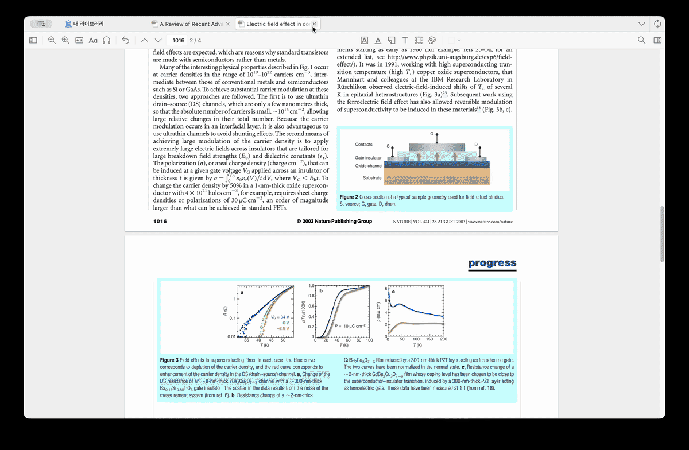
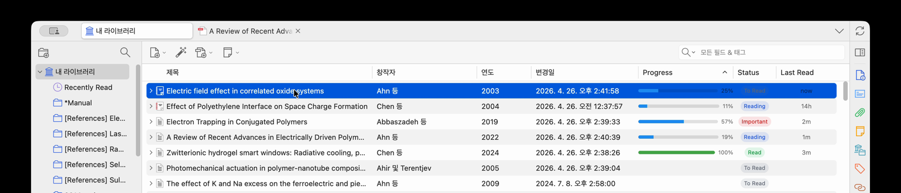
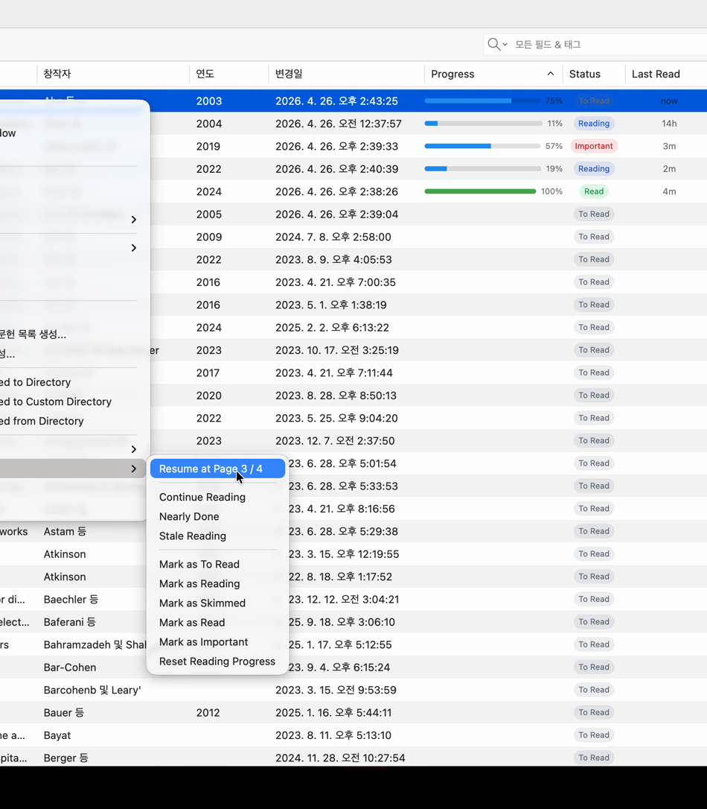

# Zotero Reading Flow

**Pick up your papers exactly where you left off — without re-scrolling.**

[](https://github.com/Moon-python/zotero-reading-flow/releases/latest)
[](https://github.com/Moon-python/zotero-reading-flow/releases/latest/download/zotero-reading-flow.xpi)
[](https://www.zotero.org/download/)

<!-- HERO: replace with a 10–15s GIF showing right-click → Resume Reading → reader opens at the saved page. -->


Zotero Reading Flow adds reading-focused columns to your library (`Progress`, `Status`, `Last Read`), remembers the last page you read, and gives you a one-click **Resume Reading** action from the context menu.

> Best for: literature researchers, thesis students, and anyone who reads many PDFs across projects and wants to pick up exactly where they stopped.

## For researchers, in practice

- **Skip duplicate scrolling:** open a tracked item and resume near your last position.
- **See what to continue:** progress, status, and last-read time are shown in the item tree.
- **Manage reading stages:** `To Read`, `Reading`, `Skimmed`, `Read`, `Important`.
- **Handle messy PDFs:** works with items that have multiple attachments under one parent record.

## Do this in 30 seconds

1. Install from the latest GitHub release.
2. Open a PDF and read a few pages.
3. Return to the library and right-click the same item.
4. Pick **Reading Flow → Resume Reading** and continue from your last position.

If this is your first use, columns appear automatically after install.

## Features

<!-- Optional: place a screenshot of the three columns in the library here. -->


- `Progress`: shows the latest tracked position for each paper in one glance.
- `Status`: displays your reading state (`To Read`, `Reading`, `Skimmed`, `Read`, `Important`) and keeps it synced with library changes.
- `Last Read`: shows when this paper was last updated (`5 min ago`, `today`, `yesterday`, ...).
- `Reading Flow` menu: **Resume Reading**, fast status updates, and **Reset Reading Progress**.
- Auto behavior: first-run columns are enabled, reader page totals are preferred when available, and menu labels are robust across Zotero UI paths.

## Compatibility

- Zotero: `9.0` through `9.0.*`
- Tested with Zotero `9.0.1` on macOS ARM64
- Plugin ID: `readingflow@moon.com`

## Install

1. Download `zotero-reading-flow.xpi` from the latest GitHub release.
2. Open Zotero.
3. Go to **Tools → Add-ons**.
4. Click **Install Add-on From File...** and select the `.xpi`.
5. Restart Zotero if prompted.

The plugin update URL is:

```text
https://github.com/Moon-python/zotero-reading-flow/releases/latest/download/updates.json
```

## Quick start

<!-- Optional: screenshot of the right-click "Reading Flow" submenu. -->


1. Open a PDF in Zotero Reader and read some pages.
2. Return to the library.
3. Right-click the same item and select **Reading Flow → Resume Reading** to continue where you left off.
4. Right-click a regular item and use **Reading Flow → Mark as ...** for status updates.
5. Use **Reading Flow → Reset Reading Progress** when you want to restart tracking from scratch.

If you want, keep your columns always visible:

1. In the library, open the column menu.
2. Enable `Progress`, `Status`, and `Last Read`.
3. They are auto-shown on first install, but this can help when the layout has changed.

## FAQ

- How do I know this is actually working?
  Read one PDF, open the same item in the library, and confirm `Progress` updates from the last-read page.
- Can I use it on Zotero 8?
  The current update channel is configured for Zotero `9.0` to `9.0.*`.
- Does it modify my PDFs?
  No, it stores reading metadata only in Zotero item metadata.

## Data and sync behavior

Reading Flow stores progress in the parent item’s `Extra` field as one namespaced line:

```text
ReadingFlow: {"v":1, ...}
```

It preserves unrelated `Extra` metadata and only updates this plugin’s own `ReadingFlow:` line.

## Build and verification

Run the project checks before release or local release testing:

```bash
npm ci
npm run verify
```

`npm run verify` runs:

- TypeScript typecheck
- Unit tests
- XPI build
- Update manifest validation

## Troubleshooting

- If columns are not visible, restart Zotero once and check the library column chooser.
- If context menu actions do not appear, verify that a regular item is selected (or a PDF attachment for `Resume Reading`).
- If you need full help, see [docs/TROUBLESHOOTING.md](docs/TROUBLESHOOTING.md).

## Known Warnings

- Zotero may show occasional internal warnings related to item-tree or add-on initialization order in some environments.
- These are usually harmless if columns and menu items still appear; if they block normal use, include your Zotero version and a short error snippet in troubleshooting.

## Release notes

Use [docs/RELEASE.md](docs/RELEASE.md) for release process details.
