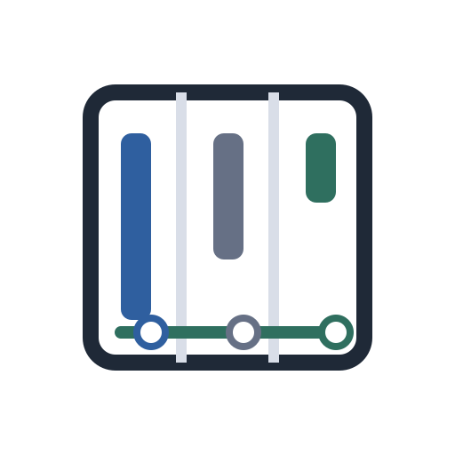

<div align="center">



</div>

# Zotero Reading Flow

> **Stop opening every PDF just to remember where you left off.**
> Reading Flow turns your Zotero library into a reading dashboard — see progress, status, and last-read time directly in the item tree.

[](https://github.com/Moonweave-Research/zotero-reading-flow/releases/latest)
[](https://github.com/Moonweave-Research/zotero-reading-flow/releases/latest/download/zotero-reading-flow.xpi)
[](https://www.zotero.org/download/)
[](LICENSE)


Best for **literature researchers, thesis students, and anyone who manages many PDFs across projects** and wants Zotero to show what is unread, in progress, prioritized, or finished — without opening a single file.

---

## Table of Contents

- [Why Reading Flow](#why-reading-flow)
- [Quick demo](#quick-demo)
- [Install (30 seconds)](#install-30-seconds)
- [Features](#features)
- [Compatibility](#compatibility)
- [How it stores data](#how-it-stores-data)
- [FAQ](#faq)
- [Build and verification](#build-and-verification)
- [Troubleshooting](#troubleshooting)
- [License](#license)

---

## Why Reading Flow

- **Scan your reading workload at a glance.** `Flow` tells you the next reading action directly in the item tree.
- **Manage reading stages.** Mark papers as `To Read`, `Reading`, `Skimmed`, or `Read`, and use `Important` when a paper should become the next high-priority read.
- **Find what needs attention.** Spot unfinished, recently touched, and completed papers without opening each PDF.
- **Handle messy PDFs.** Works with items that have multiple attachments under one parent record.
- **Resume where you left off.** Reopen the tracked PDF near its saved page from the Reading Flow menu.

## Quick demo

Right-click any paper and update its reading state in one click:


Read a PDF, return to the library, and the row updates itself:


## Install (30 seconds)

1. Download **`zotero-reading-flow.xpi`** from the [latest release](https://github.com/Moonweave-Research/zotero-reading-flow/releases/latest).
2. In Zotero, open **Tools → Add-ons**.
3. Click **Install Add-on From File...** and select the `.xpi`.
4. Restart Zotero if prompted.
5. Open your library — the `Flow` column appears automatically on first run.

The auto-update URL is:

```text
https://github.com/Moonweave-Research/zotero-reading-flow/releases/latest/download/updates.json
```

### Use it

- Right-click a paper → **Reading Flow → Mark as ...** to set its status.
- Right-click a paper → **Reading Flow → Set Priority High** to make it appear as `Read Next` or a high-urgency `Return`.
- Use **Set Priority Low** when a paper should stay visible as `Later` without competing with active reading.
- Open a PDF and read as usual — progress and last-read time update on the parent item.
- **Reading Flow → Resume Reading** to reopen the tracked PDF from its saved page.
- **Reading Flow → Reset Reading Progress** to restart tracking for an item.

Keep `Flow` visible for the most compact reading workflow. If you want separate detail columns for audit-style review, enable `Progress`, `State`, or `Last Read` from Zotero's column menu.

## Features

| Column / Action | What it does |
| --- | --- |
| **Flow** | One compact next-action column: `Read Next`, `Later`, `Resume 45%`, `Resume p. 9`, `Return 45%`, `Finish 88%`, `Skimmed`, or `Done`. |
| **Progress** | Optional detail column for latest tracked position. |
| **State** | Optional detail column for the underlying reading state (`To Read`, `Reading`, `Skimmed`, `Read`). |
| **Last Read** | Optional detail column for the last tracked reading time. |
| **Reading Flow menu** | Fast status updates, priority changes, **Resume Reading**, and **Reset Reading Progress**. |
| **Auto behavior** | First-run and upgrade-time `Flow` column is enabled, reader page totals are preferred when available, and menu labels are robust across Zotero UI paths. |

## Compatibility

- Zotero `9.0` through `9.0.*`
- Tested with Zotero `9.0.1` on macOS ARM64
- Plugin ID: `readingflow@moon.com`

## How it stores data

Reading Flow stores progress in the parent item's `Extra` field as one namespaced line:

```text
ReadingFlow: {"v":1, ...}
```

It preserves unrelated `Extra` metadata and only updates this plugin's own `ReadingFlow:` line. Your PDFs are never modified.

## FAQ

**How do I know it's actually working?**
Read one PDF, return to the library, and confirm the row shows `Resume NN%`, `Return NN%`, `Finish NN%`, or `Done` in the `Flow` column.

**Can I use it on Zotero 8?**
No. The current update channel targets Zotero `9.0` through `9.0.*`.

**Does it modify my PDFs?**
No. Reading metadata is stored only in Zotero item metadata.

**Where is my data?**
In each item's `Extra` field, on a single `ReadingFlow:` line. It syncs with your normal Zotero sync.

## Build and verification

```bash
npm ci
npm run verify
```

`npm run verify` runs:

- TypeScript typecheck
- Unit tests
- XPI build
- Update manifest validation

### Automated test-profile check

Run a reproducible runtime smoke check against a local Zotero profile:

```bash
ZOTERO_TEST_PROFILE="/path/to/profile-dir" \
ZOTERO_DATA_DIR="/path/to/zotero-data-dir" \
npm run check:release-profile -- \
  --itemKey "<item-key>" \
  --attachmentKey "<attachment-key>" \
  --attachmentPath "/path/to/zotero-data-dir/<pdf-file-path>" \
  --json
```

The script verifies:

- XPI existence and manifest metadata alignment
- Add-on loaded/enabled state from `extensions.json`
- `columnsInitialized` + `treePrefs.json` column visibility
- `flowColumnInitialized` migration state for existing installs
- Optional Zotero DB sample row checks (`itemKey` / `attachmentKey` / `attachmentPath`)

## Troubleshooting

- **Columns missing?** Restart Zotero once and check the library column chooser.
- **Context menu actions missing?** Make sure a regular item is selected (or a PDF attachment for `Resume Reading`).
- **Internal warnings in the Zotero log?** Item-tree or add-on initialization warnings are usually harmless as long as columns and menu items appear. If they block normal use, file an issue with your Zotero version and a short error snippet.
- For full help, see [docs/TROUBLESHOOTING.md](docs/TROUBLESHOOTING.md).

## Release notes

See [CHANGELOG.md](CHANGELOG.md) for user-facing changes and [docs/RELEASE.md](docs/RELEASE.md) for the release process.

## Contributing

Issues and pull requests are welcome. If you're filing a bug, please include your Zotero version, OS, and (if possible) a short reproducer.

## License

MIT License. Copyright (c) 2026 Moon-Young Choi.

The "Reading Flow" name and project branding should not be used to imply official endorsement by the original author.
